# Music
There are 2 parts in this project:
- the web application
- the mobile application

# Web application
## How to run the web application
Run the folowing commands in terminal:
```
cd web_app
npm run dev
```

# Mobile application
## How to run the mobile application
Start the emulator in android studio and run the following commands in terminal:
```
cd flutter_app
flutter run
```
## Application architecture
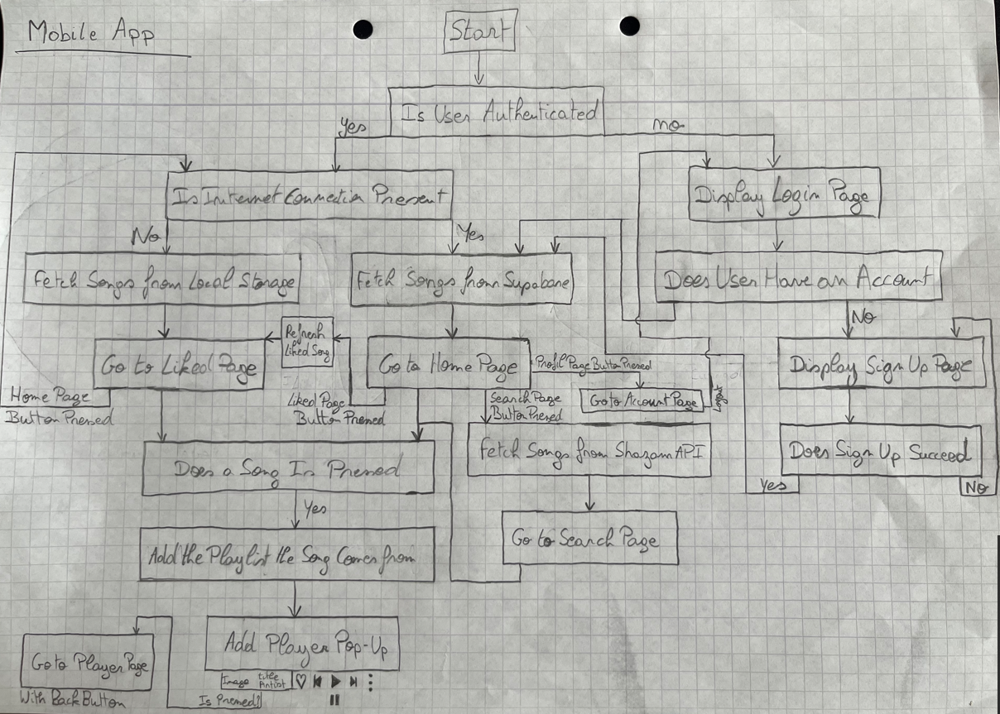

## Pages
### SignUp & LogIn
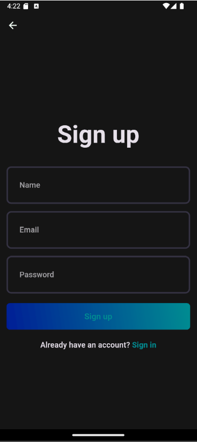
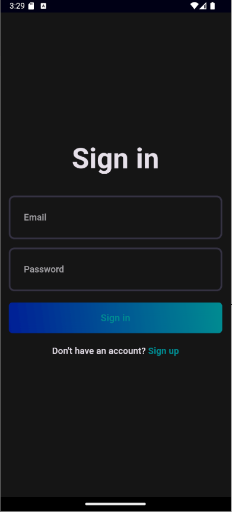
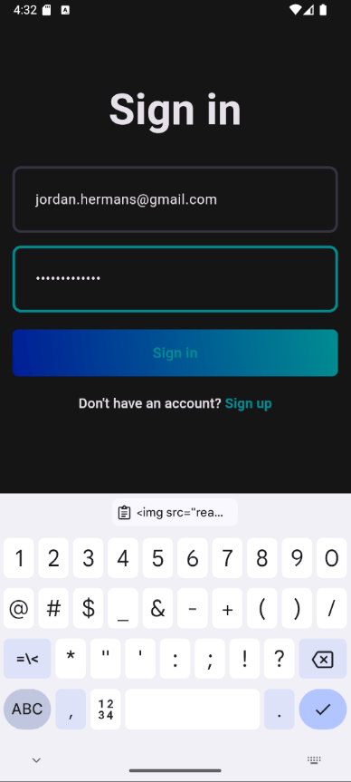

### HomePage
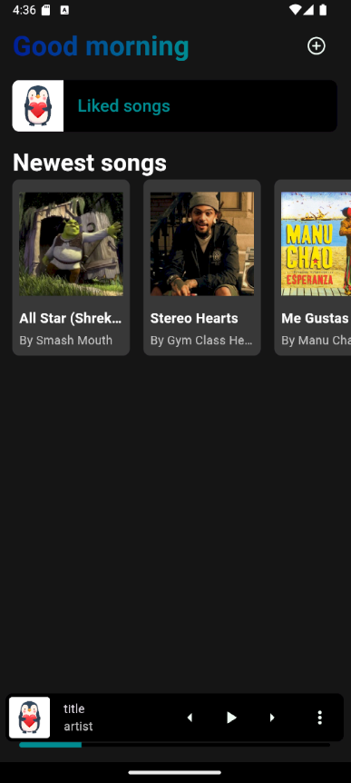
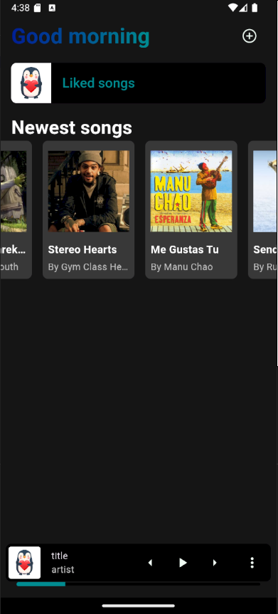

### UploadSong
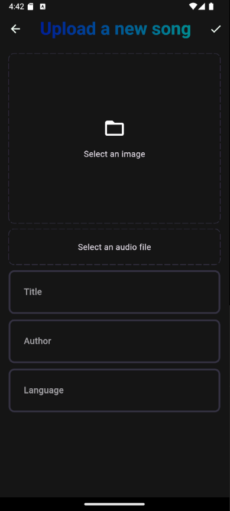
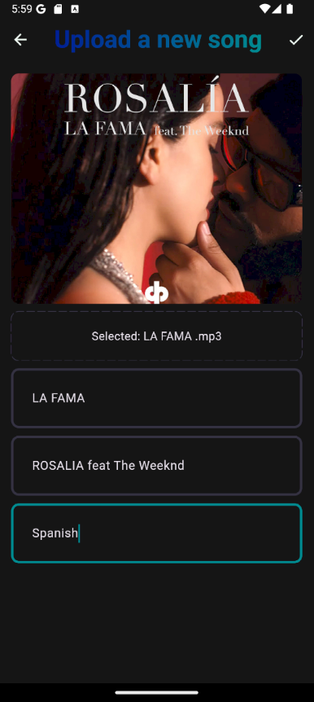

### LikedSongs
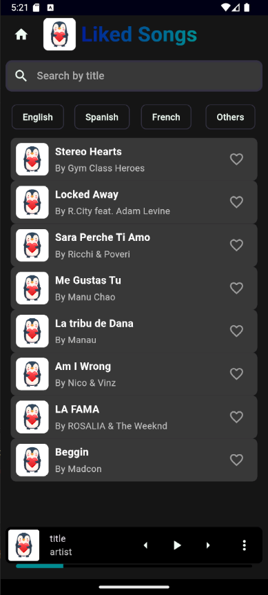
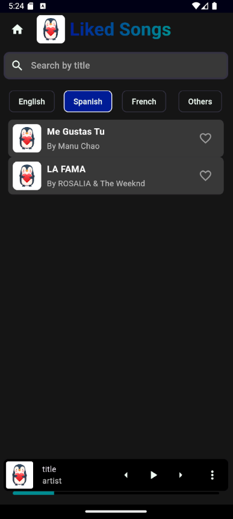
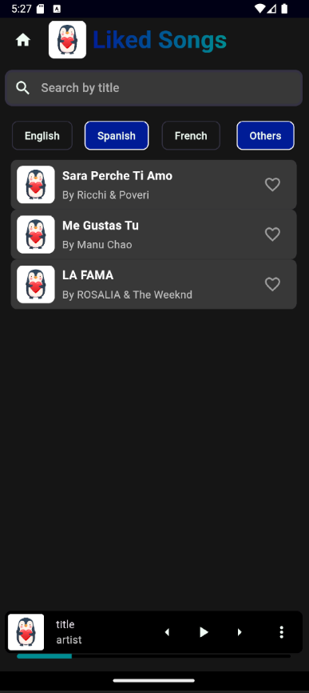
